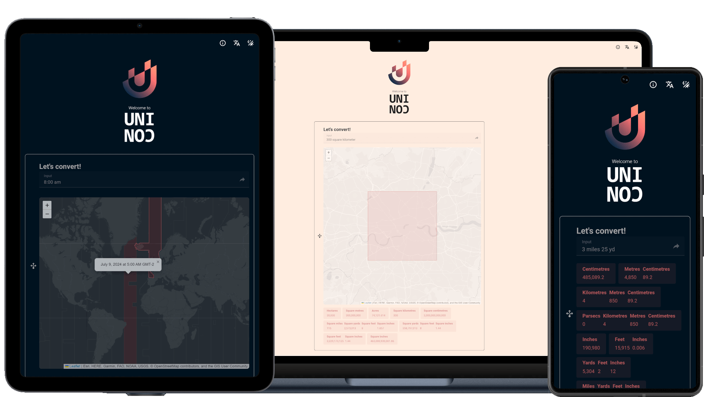

# UNICON

   
  <h1 align="center">UNICON</h1>

UNICON is a Progressive Web App that helps you convert any unit to any other unit. So metres into yards, kilograms into stones and pounds, acres into square feet etc.
UNICON works completely offline so you can use it when you're out and about.

## Usage

Enter whatever you want to convert in the format `<value> <unit>` with a space in the middle, so `12 stones`, `341 m` or `300 hectare`.

You can enter multiple inputs of the same type using the same format as above for each one, but also separated with a space, so `<value1> <unit1> <value2> <unit2>...`, e.g. `12 stone 7 lb` or `7 miles 300 yards 2 foot 1 inch`.

There is currently limited support for timezone data so you can enter a time of day in your own timezone (`8:30 am` or `21:10`) and it will show you the local time in other timezones.

For area units (`acres`, `m2`, `square foot` etc) UNICON will show a map previewing the area. If allowed, it will base the map around your current location.

## Comments

UNICON is by far not a complete list of conversion tools. There is a limited list of units and a limited list of unit types. I'm planning to expand these lists over time so bear with me.

## UNICON website

UNICON is available at https://sebastian-raubach.github.io/unicon